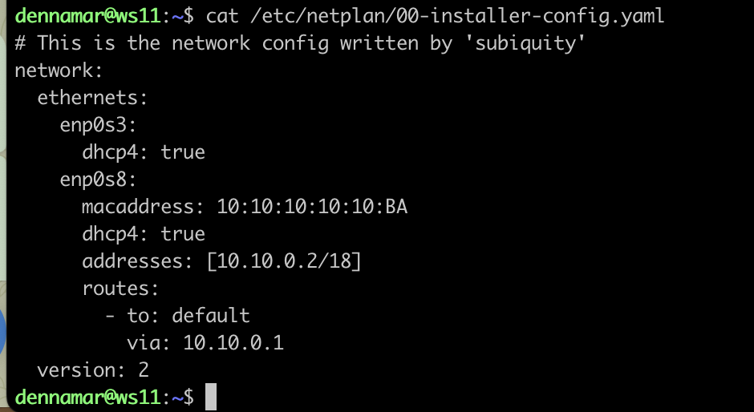
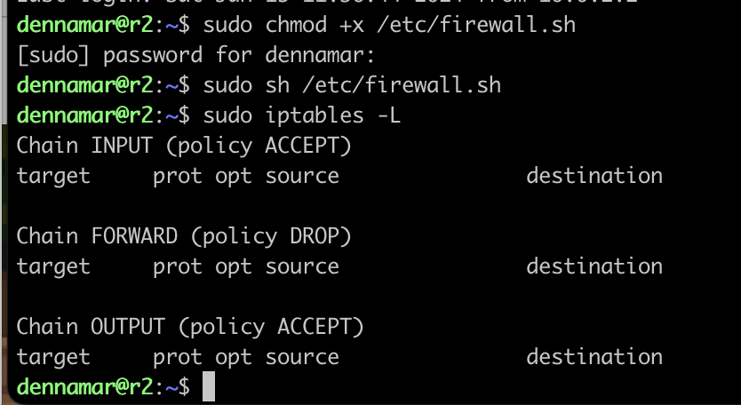

# Сети в Linux
Настройка сетей в Linux на виртуальных машинах.

Первое, что я сделал - установил все необходимые библиотеки и обновил виртуалку. Все это необходимо для будущего клонирования.
```
sudo apt-get update && sudo apt-get upgrade
sudo apt-get install ipcalc iperf3 iptables nmap traceroute inetutils-traceroute isc-dhcp-server openssh-server apache2
```

## Part 1. Инструмент **ipcalc**

### 1.1 Сети и маски 

1) Адрес сети 192.167.38.54/13

    - Для начала установим утилиту `ipcalc`:
    ```
    sudo apt update
    sudo apt install ipcalc
    ```

    - Выполним команду для определения адреса сети:
    ```
    ipcalc 192.167.38.54/13
    ```
    

2) Перевод маски 255.255.255.0 в префиксную и двоичную запись, /15 в обычную и двоичную, 11111111.11111111.11111111.11110000 в обычную и префиксную

    - Маска 255.255.255.0 в префиксную и двоичную запись:
    ```
    ipcalc 255.255.255.0
    ```

    
    *префиксная и двочная запись*

    Префиксная запись сетевой маски обозначается как /N, где N — это количество единичных битов в маске. Например, маска 255.255.255.0 в префиксной записи будет выглядеть как /24, поскольку она содержит 24 единичных бита.

    - Маска /15 в обычную и двоичную запись:
    ```
    ipcalc /15
    ```

    
    *обычная и двочная запись*

    - Маска 11111111.11111111.11111111.11110000 в обычную и префиксную запись.
    Поскольку 11111111 = 255, а 11110000 = 240:
    ```
    ipcalc 255.255.255.240
    ```

    
    *обычная и префиксная запись*

3) Минимальный и максимальный хост в сети 12.167.38.4 при масках: /8, 11111111.11111111.00000000.00000000, 255.255.254.0 и /4

    Далее используется все та же известная нам команда `ipcalc [ip]`

    - Для маски `/8`:

    
    <!-- *Для маски `/8`* -->

    *Минимальный хост: `255.0.0.1`*

    *Максимальный хост: `255.0.0.254`*

    - Для маски `11111111.11111111.00000000.00000000`, что эквивалентно `/16`, так как 16 единиц:

    
    *Для маски `/16`*

    *Минимальный хост: `255.255.0.1`*

    *Максимальный хост: `255.255.0.254`*

    - Для маски 255.255.254.0:

    
    <!-- *Для маски `255.255.254.0`* -->

    *Минимальный хост: `255.255.255.1`*

    *Максимальный хост: `255.255.255.254`*

    - Для маски /4:

    
    <!-- *Для маски `/4`* -->

    *Минимальный хост: `240.0.0.1`* 

    *Максимальный хост: `240.0.0.254`*

### 1.2 localhost

1) Определим и запишем в отчёт, можно ли обратиться к приложению, работающему на localhost, со следующими IP: 194.34.23.100, 127.0.0.2, 127.1.0.1, 128.0.0.1

    - Для того, чтобы это определить попробуем пингануть эти адреса с помощью команды `ping [address]`. Результат:
    ```
    194.34.23.100 - нельзя
    127.0.0.2     - можно
    127.1.0.1     - можно
    128.0.0.1     - нельзя
    ```
    Фактически можно пинговать только адреса 127.0.0.0/8, так как они относятся к localhost.

### 1.3 Диапазоны и сегменты сетей

1) Какие из перечисленных IP можно использовать в качестве публичного, а какие только в качестве частных: 10.0.0.45, 134.43.0.2, 192.168.4.2, 172.20.250.4, 172.0.2.1, 192.172.0.1, 172.68.0.2, 172.16.255.255, 10.10.10.10, 192.169.168.1:

    По старой тактике применяем `ipcalc`. Если в последней строке после класса (В выводе ipcalc "Class A", "Class B", "Class C" указывает на классическую классификацию IP-адресов) написано `Private Internet`, значит это *барабанная дробь* частный IP-адрес, а если такое замечание отсутствует, то public.

    Приватные IP-адреса находятся в следующих диапазонах:

    - 10.0.0.0 – 10.255.255.255 (10.0.0.0/8)
    - 172.16.0.0 – 172.31.255.255 (172.16.0.0/12)
    - 192.168.0.0 – 192.168.255.255 (192.168.0.0/16)

    ```
    10.0.0.45/8       - частный
    134.43.0.2/16     - публичный
    192.168.4.2/16    - частный
    172.20.250.4/12   - частный
    172.0.2.1/12      - публичный
    192.172.0.1/12    - публичный
    172.68.0.2/12     - публичный
    172.16.255.255/12 - частный
    10.10.10.10/8     - частный
    192.169.168.1/16  - публичный
    ```

    
    *частные и публичные адреса*

    Отходя от темы: 
    
    a) Class A (Класс A): Диапазон IP-адресов от 0.0.0.0 до 127.255.255.255.

    - Маска сети по умолчанию: 255.0.0.0 (или /8).
    - Подходит для крупных сетей с большим количеством хостов.
    
    b) Class B (Класс B): Диапазон IP-адресов от 128.0.0.0 до 191.255.255.255.

    - Маска сети по умолчанию: 255.255.0.0 (или /16).
    - Используется для средних по размеру сетей.
    
    c) Class C (Класс C): Диапазон IP-адресов от 192.0.0.0 до 223.255.255.255.

    - Маска сети по умолчанию: 255.255.255.0 (или /24).
    - Применяется для небольших сетей.
    
    d) Class D (Класс D): Диапазон IP-адресов от 224.0.0.0 до 239.255.255.255.

    - Используется для мульткастинга (распространение данных на множество хостов).
    e) Class E (Класс E): Диапазон IP-адресов от 240.0.0.0 до 255.255.255.255.

    - Зарезервировано для будущего использования и для экспериментальных целей.

2) Какие из перечисленных IP адресов шлюза возможны у сети 10.10.0.0/18: 10.0.0.1, 10.10.0.2, 10.10.10.10, 10.10.100.1, 10.10.1.255

    Диапазон сети: 10.10.0.1 - 10.10.63.254. Тогда входят следующие адреса:
    ```
    10.10.0.2
    10.10.10.10
    10.10.1.255
    ```

    

## Part 2. Статическая маршрутизация между двумя машинами.

**Далее сверху скрин машины ws1, а ниже ws2**

1) Для начала давайте посмотрим какие сетевые интерфейсы есть у наших машин командой `ip a`:

    
    *Сетевые интерфейсы ws1*

    
    *Сетевые интерфейсы ws2*

2) Опишем сетевой интерфейс, соответствующий внутренней сети, на обеих машинах и зададим следующие адреса и маски: ws1 - *192.168.100.10*, маска */16*, ws2 - *172.24.116.8*, маска */12*.

    *Далее под адаптарами мы понимаем сетевой интерфейс*

    - Начнем с того, что выключим машину ws1.
    - Далее для машины ws1 переходим "Настройки" -> "Сеть".
    - Адаптер 1 оставляем без изменений, переходим в адаптер 2.

        
        *Настройки адаптера ws1 для локальной(внутренней) сети intnet*

        После манипуляций проверим новый сетевый интерфейс:
        

    - Проделаем те же манипуляции с машиной ws2.

        
        *Настройки адаптера ws2 для локальной(внутренней) сети intnet*

    - Изменения в сетевые интерфейсы вносим с `sudo nano /etc/netplan/00-installer-config.yaml`, потому что в vim я опять затупил.

        
        *Для машины ws1*
        
        
        *Для машины ws2*

    - Теперь применем команды `sudo netplan apply` для перезапуска сервиса сети, для каждой машины:

        *Для машины ws1: (для ws2 аналогично)*
        
        
    a) Добавим статический маршрут при помощи команды `sudo ip r add`
    - **Проверка конфигурации!** После настройки IP-адресов на обеих виртуальных машинах, убедеждаемся, что они могут пинговать друг друга:

        
        

    b) Добавление статического маршрута с сохранением.
    Это означает, что маршрут будет сохраняться после перезагрузки системы. Если мы просто добавим маршрут с помощью команды `ip route add`, он исчезнет после перезагрузки. Чтобы сохранить маршрут, нужно внести изменения в конфигурационные файлы сети.

    - Добавим необходимые конфигурации для постоянного ручного соединения в знакомый файл `/etc/netplan/00-installer-config.yaml`:

        
        
        
## Part 3. Утилита **iperf3**

Я - скорость.

1) Скорость соединения.

    - Переведем: 8 Mbps в MB/s, 100 MB/s в Kbps, 1 Gbps в Mbps.

    ```
    1 byte = 8 bits
    1 kilobyte (KB) = 1,000 bytes (B)
    1 megabyte (MB) = 1,000 kilobytes (KB)
    1 gigabyte (GB) = 1,000 megabytes (MB)
    1 kilobit (Kb) = 1,000 bits (b)
    1 megabit (Mb) = 1,000 kilobits (Kb)
    1 gigabit (Gb) = 1,000 megabits (Mb)
    ```

    - 8 Mbps в MB/s: 1 byte = 8 bits => 8 Mbps = 1 MB/s.
    - 100 MB/s в Kbps: 100 MB/s * 1,000 = 100,000 KB/s => 100,000 KB/s * 8 = 800,000 Kbps.
    - 1 Gbps = 1000 Mbps: 1 Gbps * 1,000 = 1,000 Mbps

2) Утилита **iperf3**

    - Измерим скорость соединения между машинами ws1 и ws2. Для этого 
    
    a) запустим `iperf3 -s` в режиме сервера на одной из машин (например, ws2), тогда сервер будет слушать входящте соединения на порту 5201 по умолчанию.

    b) На машине ws1 выполним команду для запуска iperf3 в режиме клиента, указывая IP-адрес машины ws2:
    ```
    iperf3 -c 172.24.116.8
    ```

    Возникла ошибка, потому что соединение не устанавливалось, хотя все пинговалось. Выяснилось, что порт 5201 был закрыт для входящих соединений на сервере. Пришлось выполнить команды `sudo ufw allow 5201/tcp` и `sudo ufw reload`, после чего все получилось:

        
        

    Таким образом, средняя скорость (Bitrate) на интервале 0-10 секунд составила 1.63 Gbits/s. Данная скорость считается высокой.

## Part 4. Сетевой экран.

Для того, чтобы контролировать информацию, прлходящую по соединению нам нужно сделать сетевой экран. 

Создадим файл(скрипт) `/etc/firewall.sh`, иметирующий фаерволл(правила установки соединения между машинами) на ws1 и ws2, применяем следующие правила:

1) На ws1 применим стратегию, когда в начале пишется запрещающее правило, а в конце пишется разрешающее правило (это касается пунктов 4 и 5).

2) На ws2 применим стратегию, когда в начале пишется разрешающее правило, а в конце пишется запрещающее правило (это касается пунктов 4 и 5).

3) Откроем на машинах доступ для порта 22 (ssh) и порта 80 (http).

4) Запретим echo reply (машина не должна «пинговаться», т.е. должна быть блокировка на OUTPUT).

5) Разрешим echo reply (машина должна «пинговаться»).

    

## Part 5. Статическая маршрутизация сети


Поднимем пять виртуальных машин (3 рабочие станции (ws11, ws21, ws22) и 2 роутера (r1, r2)). Для бодрости будем их клонировать через VirtualBox.

### 1) Настройка адресов машин.

Настроим конфигурации машин в `etc/netplan/00-installer-config.yaml` согласно сети на рисунке. 

Разберем, что тут происходит подробно. Нам надо связать две локальные сети через роутеры r1 и r2. В них будут прописаны маршруты.

Для r1:
- Интерфейс enp0s8 настроен на использование статического IP-адреса 10.10.0.1 с маской подсети /18.
- Интерфейс enp0s9 также настроен на использование статического IP-адреса 10.100.0.11 с маской подсети /16. Кроме того, у этого интерфейса есть маршрут для подсети 10.20.0.0/26 через шлюз 10.100.0.12.

Для r2 зеркально.

Разберем машины ws11, ws21 и ws22, на примере ws1:
- Для интерфейса enp0s8 DHCP отключен, и указан статический IPv4 адрес 10.10.0.2 с маской подсети/18.

- Также указано маршрутизационное правило, что для всех пакетов, направленных в сеть по умолчанию (default), они должны быть отправлены через шлюз 10.10.0.1.

Скрин с настройками сети:
    

*Не забываем прописать `sudo netplan apply`, чтобы применить текущие конфигурации на серверах.*

Командой `ip -4 a` проверяем, что все сетевые интерфейсы на базе.


Пинганем ws11 и r1:
    

Пинганем ws21 и ws22:
    

### 2) Включение переадресации IP-адресов
    
Для включения переадресации IP, выполним команду `sysctl -w net.ipv4.ip_forward=1` на роутерах, однако при таком подходе переадресация не будет работать после перезагрузки системы:
    

Сделаем так, чтобы IP-переадресация работала на постоянной основе. Для этого раскомментируем строку (как на скрине) в файле `/etc/sysctl.conf `:
    
    


### 3) Установка маршрута по-умолчанию

Настроим маршрут по-умолчанию (шлюз) для рабочих станций. Для этого добавим default перед IP роутера в файле конфигураций `etc/netplan/00-installer-config.yaml` (выводы юудут в скрине)

Рассмотрим вывод команды `ip r`. Нас интересует локальная сеть, поэтому рассмотрим вывод команды с 4 строки **для r1**:

- Четвертая строка указывает на доступ к сети 10.10.0.0/18 напрямую через сетевое устройство enp0s8 с исходным IP-адресом 10.10.0.1.

- Пятая строка говорит о том, что для доступа к сети 10.20.0.0/26 необходимо использовать шлюз с IP-адресом 10.100.0.12 через сетевое устройство enp0s9.

- Шестая строка показывает, что сеть 10.100.0.0/16 доступна непосредственно через сетевое устройство enp0s9, с исходным IP-адресом 10.100.0.11.


тут на скрине выше есть неточность, поэтому для проверки файлов конфигураций посмотрим на первый скрин с конфигурациями в этой части.


tcpdump - это утилита командной строки в UNIX-подобных операционных системах, которая используется для захвата и анализа сетевого трафика.

- tn - опции команды tcpdump, которые указывают утилите выводить только IP-адреса и порты без разрешения имен и портов.

- i eth0 - опция команды tcpdump, которая указывает утилите на сетевой интерфейс, через который нужно захватывать трафик. В данном случае, eth0 это название сетевого интерфейса (Ethernet), который будет использоваться для захвата трафика.

- "icmp" - фильтр, который указывает tcpdump отображать только пакеты протокола ICMP.

Таким образом, данная команда будет захватывать сетевой трафик на интерфейсе eth0, выводя только IP-адреса и порты отправителя и получателя в формате без разрешения имен.

Пропингуем с ws11 роутер r2 и покажем на r2, что пинг доходит. Для этого используем команду `sudo tcpdump -tn -i enp0s8 icmp`:


### 4) Добавление статических маршрутов

Добавим в роутеры r1 и r2 статические маршруты в файле конфигураций. Пример для r1 маршрута в сетку 10.20.0.0/26: 
```
- to: 10.20.0.0
  via: 10.100.0.12
```

Это означает, что для достижения сети 10.20.0.0 маршрутизатор r1 будет отправлять трафик через маршрутизатор с IP-адресом 10.100.0.12. Этот статический маршрут указывает на то, что трафик к сети 10.20.0.0 должен быть направлен через указанный роутер. Не забываем, что статические маршруты используются для указания конкретных путей передачи данных в сети.


Посмотрим на пути, которые мы уже разбирали в предыдущем пункте.


Теперь от нас требуется запустить на машине ws11 команды `ip r list 10.10.0.0/[маска сети]` и `ip r list 0.0.0.0/0`

Команда `ip r list 10.10.0.0/18` выводит информацию о маршруте для подсети с адресом 10.10.0.0 и указанной маской сети. Этот маршрут будет выбран, когда пакет должен быть направлен на узел в данной сети, потому что маска /18 описывает маршрут к сети точнее, в отличие от маски /0. Маршрут по умолчанию default имеет самый низкий приоритет из всех возможных.

С другой стороны, команда ip r list 0.0.0.0/0 указывает на маршрут по умолчанию, который используется для отправки всех пакетов, не имеющих явно указанный маршрут. Этот маршрут будет применяться, когда не существует более специфичного маршрута для адреса назначения.

Получается в сети настроены два маршрута. Первый маршрут указывает на сеть 10.10.0.0/18 через устройство enp0s8 с IP-адресом 10.10.0.2. Второй маршрут указывает на сеть 0.0.0.0/0 (то есть на любую сеть) через шлюз 10.10.0.1 и также через устройство enp0s8.

### 5) Построение списка маршрутизаторов
    
Включил сервер на машине r1 командой `sudo tcpdump -tn -i enp0s8 icmp`, которая устанавливает флаги для вывода только IP-адресов и номеров портов (-tn), выбирает интерфейс enp0s8 для захвата пакетов и фильтрует только icmp пакеты. Она будет выводить только icmp пакеты, проходящие через интерфейс enp0s8 в формате IP-адрес отправителя и получателя.

Протокол ICMP (Internet Control Message Protocol) используется для отправки сообщений об ошибках и управления сетью. Он может использоваться для проверки доступности узлов в сети с помощью ICMP Echo запросов и ответов, а также для передачи информации об ошибках, не доставленных пакетах и других сетевых проблемах.

Потом на машине w11 при помощи утилиты traceroute строим список маршрутизаторов на пути от ws11 до ws21: `traceroute [адрес сети]`:

Ура! Получилось. Список полный и удовлетворяет плану сети.

*Принцип работы traceroute:*

Для определения промежуточных маршрутизаторов traceroute отправляет серию пакетов данных целевому узлу, при этом каждый раз увеличивая на 1 значение поля TTL («время жизни»). Это поле обычно указывает максимальное количество маршрутизаторов, которое может быть пройдено пакетом. Первый пакет отправляется с TTL, равным 1, и поэтому первый же маршрутизатор возвращает обратно сообщение ICMP, указывающее на невозможность доставки данных. Traceroute фиксирует адрес маршрутизатора, а также время между отправкой пакета и получением ответа (эти сведения выводятся на монитор компьютера). Затем traceroute повторяет отправку пакета, но уже с TTL, равным 2, что позволяет первому маршрутизатору пропустить пакет дальше.

Процесс повторяется до тех пор, пока при определённом значении TTL пакет не достигнет целевого узла. При получении ответа от этого узла процесс трассировки считается завершённым.

Вот почему так долго эта утилита не выдвет результат. Она работает и не прохлождается.

### 6) Использование протокола ICMP при маршрутизации:

Запустим на r1 перехват сетевого трафика, проходящего через eth0 с помощью команды `sudo tcpdump -tn enp0s8 icmp`, как в предыдущем пункте, но на этот раз пропингуем с машины ws11 несуществующий IP и посмотрим, что же будет! 


При выполнении команды на машине r1, выведется трафик ICMP пакетов, которые будут перехвачены при попытке пропинговать несуществующий IP с машины ws11. В выводе tcpdump можно увидеть IP адрес машины ws11, а также информацию об ICMP пакетах, которые пришли на машину r1 в результате неудавшегося пинга.

*Сохраним дампы образов виртуальных машин, сделав их скриншот в VirtualBox*

## Part 6. Динамическая настройка IP с помощью DHCP

**В данном задании используются виртуальные машины из Части 5.**

- Для r2 настрой в файле /etc/dhcp/dhcpd.conf конфигурацию службы DHCP:

### 1) Укажем адрес маршрутизатора по-умолчанию, DNS-сервер и адрес внутренней сети. По примеру:


### 2) В файле resolv.conf прописать nameserver 8.8.8.8.
- Было:


- Стало:


- Перезагрузить службу DHCP командой `systemctl restart isc-dhcp-server`. Машину ws21 перезагрузить при помощи `reboot` и через `ip a` показать, что она получила адрес. Также пропинговать ws22 с ws21.

    

    

- Пинг ws22 с ws21:

    

- Добавим MAC-адрес для ws1:

    

- Настроим r1 аналогично r2, но сделаем выдачу адресов с жесткой привязкой к MAC-адресу (ws11).

    

- Для r1 настроить аналогично r2, в файле resolv.conf прописать nameserver 8.8.8.8.

    

- Перезагрузить службу DHCP командой `systemctl restart isc-dhcp-server`. Машину ws11 перезагрузить при помощи `reboot` и через `ip a` показать, что она получила адрес.

    
    

- Пользовался следующими опциями DHCP сервера в данном пункте.
```
dhclient -r
dhclient -v
```
Команду dhclient -r для освобождения DHCP арендованного IP адреса и команду dhclient -v для запуска DHCP клиента в режиме отладки (verbose mode), чтобы увидеть более подробные логи и информацию об установлении сетевого соединения.

- Запросить с ws21 обновление ip адреса. 

     

    Для отображения IP-адреса интерфейса enp0s8 можно использовать команду `ip addr show enp0s8`. Она покажет информацию о сетевом интерфейсе enp0s8, включая его IP-адрес. Если IP-адрес на интерфейсе не настроен, команда вернет пустой вывод для этого интерфейса.

    Командой ip addr del [ip-address/netmask] dev [interface] можно удалить статическую конфигурацию интерфейса. После этого можно повторить команду sudo dhclient -4 enp0s8, чтобы получить IP-адрес от DHCP-сервера.

## Part 7. **NAT**

**В данном задании используются виртуальные машины из Части 5.**

1. В файле /etc/apache2/ports.conf на ws22 и r1 изменим строку Listen 80 на Listen 0.0.0.0:80, то есть сделай сервер Apache2 общедоступным.

    

2. Запустим веб-сервер Apache командой `service apache2 start` на ws22 и r1.

    

Пропингуем r1 с ws22 чтобы убедиться, что пакеты проходят и связь есть: `ping -c 4 10.100.0.11`

    

3. Добавим в фаервол, созданный по аналогии с фаерволом из Части 4, на r2 следующие правила:

    1) Удаление правил в таблице filter - `iptables -F`;

    2) Удаление правил в таблице "NAT" - `iptables -F -t nat`;

    3) Отбрасывать все маршрутизируемые пакеты - `iptables --policy FORWARD DROP`.

    

    Теперь запустим файл также, как в Части 4, то есть сначала дадим нужные права доступа и запустим `sudo chmod +x /etc/firewall.sh && sudo sh /etc/firewall.sh`:

    

    Проверим, что пинг ws22 и r1 не проходит:

    

4. Добавь в файл ещё одно правило в фаервол r2: разрешим маршрутизацию всех пакетов протокола ICMP.

    ```
    iptables -A FORVARD -p icmp -j ACCEPT 
    ```

    Правило позволяет проходить трафику ICMP (Internet Control Message Protocol) через межсетевой экран (firewall). Таким образом, пакеты, отправленные с использованием протокола ICMP, будут разрешены для пересылки на другой сетевой интерфейс.

    - -A FORWARD - добавляет правило для цепочки FORVARD, которая отвечает за перенаправление пакетов

    - -p icmp - указывает, что это правило применяется к ICMP пакетам (например, пакеты ping)

    - -j ACCEPT - указывает, что если пакет соответствует условиям правила, то его следует принять и передать дальше

    

    Проверим, что пинг ws22 и r1 проходит:

    

**Добавим в файл ещё два правила:**

5. Включим SNAT, а именно маскирование всех локальных ip из локальной сети, находящейся за r2 (по обозначениям из Части 5 - сеть 10.20.0.0).

    `sudo iptables -A FORWARD -p tcp --dport 80 -j ACCEPT` 
    
    - "-A FORWARD": добавить правило в цепочку FORWARD, которая отвечает за пересылку пакетов между сетевыми интерфейсами

    - "-p tcp": указание на то, что правило относится к протоколу TCP
    
    - "--dport 80": указание на то, что это правило применяется для пакетов, у которых порт назначения 80 (например, HTTP-трафик)

    - "-j ACCEPT": указание на то, что пакеты, соответствующие этому правилу, должны быть приняты и переданы дальше

    `sudo iptables -A FORWARD -p tcp --sport 80 -j ACCEPT`
    
    - "sudo iptables": также команда для управления настройками iptables

    - "-A FORWARD": добавить правило в цепочку FORWARD

    - "-p tcp": указание на протокол TCP


    - "--sport 80": указание на то, что это правило применяется для пакетов, у которых порт отправителя 80

    - "-j ACCEPT": указание на то, что пакеты должны быть приняты и переданы дальше

    Таким образом, первое правило разрешает передачу TCP-трафика с портом назначения 80 (например, запросы на веб-сайты), а второе правило разрешает передачу TCP-трафика с портом отправителя 80 (например, ответы на запросы). Эти правила позволяют обработать HTTP-трафик между различными устройствами в сети.

    Рассмотрим еще два правила iptables, которые относятся к таблице NAT (Network Address Translation) и предназначены для перенаправления сетевого трафика.

    a) `sudo iptables -t nat -A POSTROUTING -o enp0s8 -s 10.20.0.0/26 -j SNAT --to-source 10.100.0.12`:

    - -t nat указывает, что правило применяется к таблице NAT.

    - -A POSTROUTING означает, что это правило применяется к пакетам после того, как они покинули сервер.

    - -o enp0s8 задает исходящий интерфейс, через который будут отправляться пакеты.

    - -s 10.20.0.0/26 указывает на исходный IP-адрес пакетов.

    - -j SNAT --to-source 10.100.0.12 говорит о том, что нужно применить механизм SNAT (Source Network Address Translation) и заменить исходный IP-адрес на указанный (10.100.0.12).

6. Включи DNAT на 8080 порт машины r2 и добавить к веб-серверу Apache, запущенному на ws22, доступ извне сети.

    b) `sudo iptables -t nat -A PREROUTING -p tcp --dport 8080 -j DNAT --to-destination 10.20.0.20:80`:

    - -t nat указывает, что правило применяется к таблице NAT.
    
    - -A PREROUTING означает, что это правило применяется к пакетам до того, как они попадут на сервер.

    - -p tcp --dport 8080 указывает на применение правила только для TCP пакетов, направленных на порт 8080.

    - -j DNAT --to-destination 10.20.0.20:80 говорит о том, что нужно применить механизм DNAT (Destination Network Address Translation) и изменить адрес назначения на указанный (10.20.0.20) и порт на 80.

    Таким образом, первое правило изменяет исходный IP-адрес пакетов, покидающих сервер, на 10.100.0.12. Второе правило перенаправляет пакеты, поступающие на порт 8080, на другой сервер с IP-адресом 10.20.0.20 и портом 80.

    Запустим файл:
    

    **Перед тестированием рекомендуется отключить сетевой интерфейс NAT (его наличие можно проверить командой ip a) в VirtualBox, если он включен**

    Проверить соединение по TCP для SNAT, для этого с ws22 подключиться к серверу Apache на r1 командой: `sudo telnet 10.100.0.11 80`

    

    Ура! Соединение с интернетом есть и неважно, что HTTP-запрос "а" не обработался))

    В ответе сервера также указывается информация о сервере (Apache/2.4.41 на Ubuntu), время ответа, длина содержимого, и тип содержимого. Также указывается сообщение о том, что сервер не смог понять запрос клиента.

FINALY! Проверить соединение по TCP для DNAT, для этого с r1 подключиться к серверу Apache на ws22 командой telnet (обращаться по адресу r2 и порту 8080):


