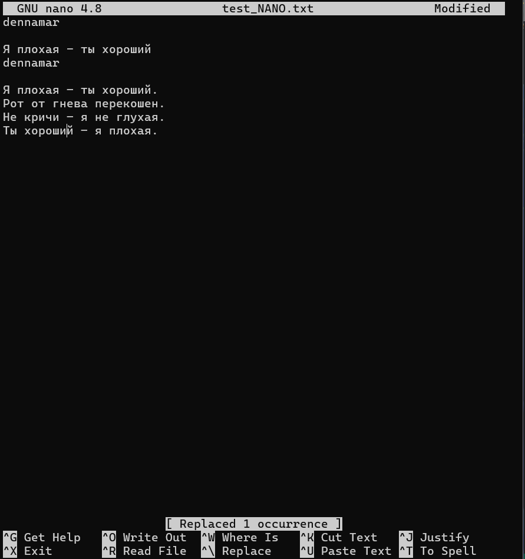
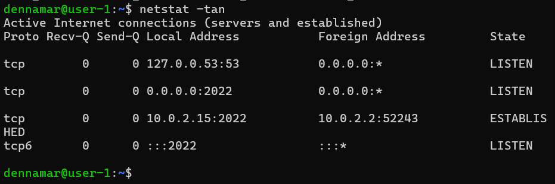
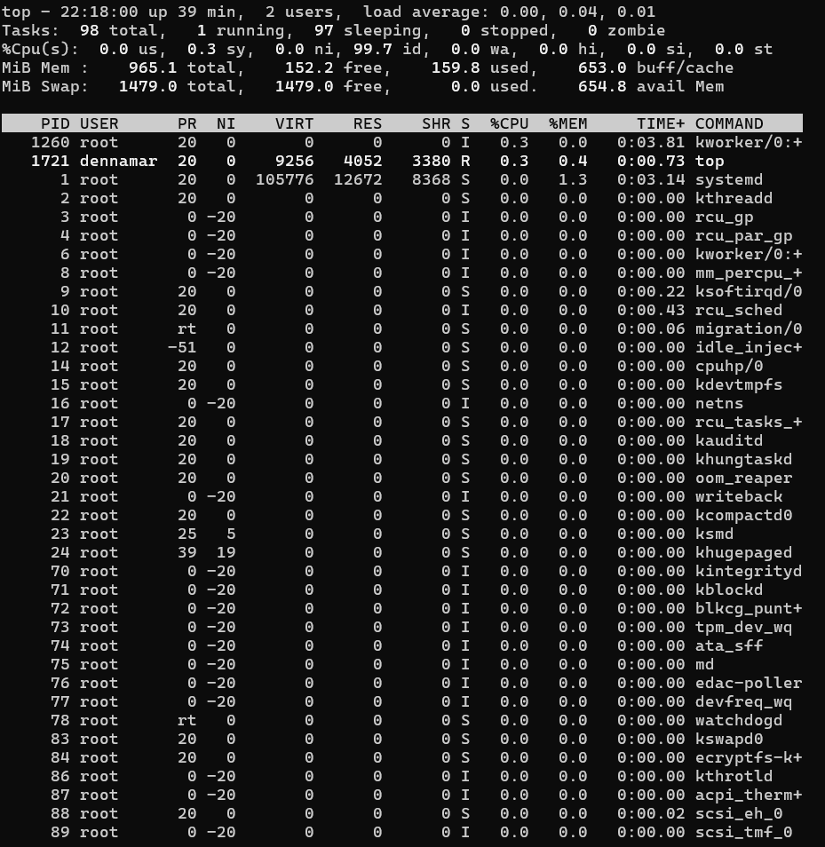
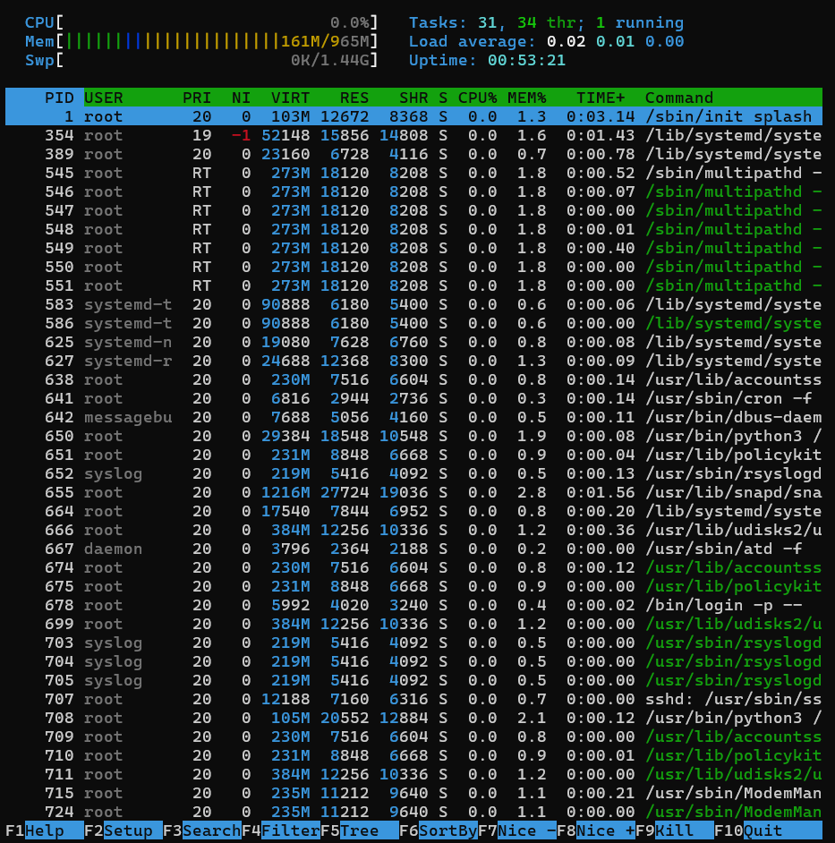
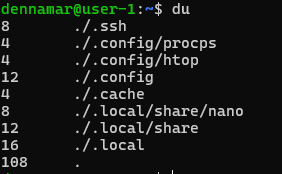
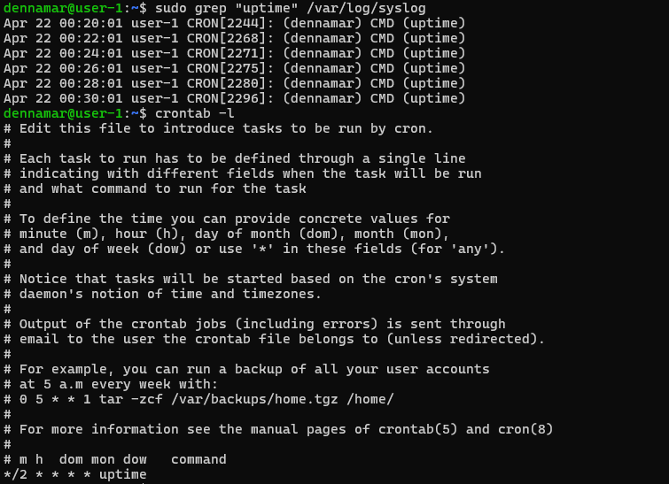

# Операционные системы UNIX/Linux (Базовый)
Установка и обновления системы Linux. Основы администрирования.

## Part 1. Установка ОС
- Для начала я скачал ISO-образ и с его помощью в программе виртуализации VirtualBox создал ВМ без графического интерфейса.
 
    

- Узнаю версию Ubuntu.

    

- Важной вещью, которая мне очень помогла в ходе выполнения данного проекта, оказалась возможность подключения к Ubuntu через WSL. В чем же преимущество? Всё просто - возможность копировать/вставлять команды. Вот славный гайд - https://temofeev.ru/info/articles/podklyuchenie-k-ubuntu-serveru-na-virtualbox-cherez-wsl-po-ssh/

## Part 2. Создание пользователя
- Создаю нового пользователя добавляю его в группу adm
    ```
    sudo useradd user_part2 
    ```
    ```
    sudo groupadd adm
    sudo usermod -aG adm user_part2
    ```
    
    - Проверяю в файле наличие нового пользователя и принадлежность данного пользователя группе adm 
    ```
    cat /etc/passwd
    adm:x:1002:user_part2
    ```
    

## Part 3. Настройка сети ОС
- Изменяю имя ВМ.
    ```
    sudo hostnamectl set-hostname user-1
    ```
- Проверяю новое имя.

    
 
- Устанавливаю временную зону.
    ```
    sudo timedatectl set-timezone Europe/Moscow
    timedatectl
    ```
    

- Вывожу список сетевых интерфейсов (4 способа) 
    ```
    ls /sys/class/net
    ip -br link show
    ```
    

    ```
    ip address      # узнаю ip-адреса всех сетевых интерфейсов
    ifconfig        # классика
    ```

     

    lo — это фиктивный интерфейс, относящийся к данному устройству (в некоторых системах называется также loopback).

    Наличие интерфейса lo необходимо, чтобы устройство всегда могло обратиться само к себе, то есть одна компонента его программного обеспечения могла обратиться к другой.

    Интерфейс lo всегда имеет стандартный IP-префикс 127.0.0.1/8. Если его удалить, то ряд программных компонентов перестанет работать, в том числе средства конфигурации устройства. DNS-имя - localhost.

    Адрес локального псевдоинтерфейса часто используется для построения туннелей или как адрес сервера в туннельных и PPP-соединениях со многими клиентами.

- Получаю ip-адрес моего ноутбука от DHCP-сервера. 

     

    **DHCP (Dynamic Host Configuration Protocol)** — это сетевой протокол, который позволяет сетевым устройствам автоматически получать IP-адрес и другие параметры, необходимые для работы в сети TCP/IP. (шлюз, DNS)

    Протокол работает по модели «клиент-сервер». Для автоматической конфигурации компьютер-клиент на этапе конфигурации сетевого устройства обращается к серверу DHCP и получает от него нужные параметры.

- Получаю внешний ip-адрес шлюза.
    ```
    curl ifconfig.me
    ```
    

- Получаю внутренний IP-адрес шлюза, он же IP-адрес по умолчанию. Необходимый для локальной сети (от одного роутера, например)
    ```
    ip route | grep default | awk '{print $3}'
    ```
    

- Открыли файл /etc/netplan/_.yaml и применили изменения в netplan, перезагрузились
    ```
    sudo nano /etc/netplan/00-installer-config.yaml
    ```
    

    после сохранения применяем изменения и перезагружаемся:
    ```
    sudo netplan apply
    sudo reboot
    ```

- Проверяем изменения (ничего не изменилось, потому что мы просто задали все то же самое ручками)

    

- Пикгуем удаленные хосты 1.1.1.1 и ya.ru 

    ```
    ping 1.1.1.1
    ping ya.ru
    ```

    

    Пингование удаленных хостов 1.1.1.1 и ya.ru означает отправку ICMP эхо-запросов к указанным IP-адресам (в данном случае 1.1.1.1 и ya.ru) с целью определения доступности и скорости ответа этих хостов. Если удаленные хосты ответят на запросы, значит они доступны в сети. Пингование может использоваться для диагностики сетевых проблем, тестирования соединения и проверки задержки (пинг) между узлами сети.

    ping ya.ru означает, что ваш компьютер успешно отправлял запросы на пинг сайта яндекса и получал ответы от сервера ya.ru. Всего было отправлено 5 пакетов данных, каждый из которых получил ответ. Потерь пакетов не было, что указывает на стабильное соединение. Среднее время отклика (rtt) составило 9.639 мс, при этом минимальное время отклика было 7.854 мс, а максимальное - 11.243 мс.

## Part 4. Обновление ОС

- Команда apt update используется для синхронизации списков пакетов в вашей системе.
    Она извлекает последние списки пакетов PPA и репозиториев в вашей системе и обеспечивает их актуальность.
    Команда apt upgrade обновляет пакеты до последних версий и устанавливает новые пакеты, если они требуются в качестве зависимостей.
    Он не удаляет никакие пакеты, а если какие-либо из них предназначены для удаления, он их пропускает.

    ```
    sudo apt update
    ```

    

    тут пришлось исправить ошибку - закомментировать строку с cdrom в файле /etc/apt/sources.list и затем повторить команду sudo apt update. Ошибка заключается в том, что apt пытается обновить пакеты из локального cdrom, но не может найти файл Release по указанному пути.

    

    после чего:
    ```
    sudo apt upgrade
    ```
    **ждем...** 
    Скрин вывода не прикладываю, дабы не делать отчет в 100 страниц. Однако прикладываю, что обновлять больше нечего:

    

## Part 5. Использование команды **sudo**

- Команда sudo позволяет администраторам системы управлять доступом к привилегиям суперпользователя, что повышает безопасность системы, предотвращает несанкционированные изменения и помогает обеспечить надежность и стабильность работы операционной системы. Она является неотъемлемой частью механизмов контроля доступа в Unix-подобных системах.

- Добавляем пользователя из part2 в группу sudo:
    ```
    sudo usermod -aG sudo user_part2
    ```
    *далее переключаемся на пользователя user_part2:*
    ```
    su user_part2
    ```
    *смотрим имя хоста (хост если что это любой узел сети):*
    ```
    cat /etc/hostname
    ```
    *меняю имя хоста и смотрим его (оказывается с нижним подчеркиванием нельзя):*
    ```
    sudo hostname dennamar-host
    hostname
    ```
    *бежим обратно в первоначального пользователя:*
    ```
    su dennamar
    ```

    

## Part 6. Установка и настройка службы времени

- Выведем информацию о текущих настройках времени и даты на системе

     

## Part 7. Установка и использование текстовых редакторов

### С сохранением:
-   **Начинается...** Устанавливаем текстовые редакторы vim, nano, joe, точнее просто проверяем их наличие.

    ```
    sudo apt install vim
    sudo apt install nano
    sudo apt install joe
    ```
     

- Используя каждый из трех выбранных редакторов, создаю файл test_X.txt, где X -- название редактора, в котором создан файл. Пишу в нём свой никнейм, закрываю файл с сохранением изменений.

    ***VIM:***
    1. Для открытия и создания файла в vim ввожу:
    ```
    vim test_VIM.txt
    ```
    2. В vim, для перехода в режим вставки необходимо нажать клавишу i, после чего ввожу мой никнейм dennamar.

    3. Чтобы сохранить изменения и закрыть файл, нажимаю клавиши Esc для выхода из режима вставки, затем ввожу команду :wq и нажмимаю Enter. Файл сохранен.

    

    ***NANO:***
    1. Ввожу следующую команду, чтобы создать и открыть файл test_NANO.txt в редакторе nano:
    ```
    nano test_NANO.txt
    ```
    2. Пишу свой никнейм (dennamar) в открытом файле.
    3. Чтобы сохранить изменения и закрыть файл, нажмите сочетание клавиш Ctrl + O для сохранения и Enter, затем Ctrl + X для выхода из редактора.

    

    ***JOE:***
    1. Ввожу команду `joe test_JOE.txt`, чтобы открыть редактор Joe и создать файл test_JOE.txt.
    2. Пишу свой никнейм (dennamar) в файле.
    3. Чтобы сохранить изменения и закрыть файл, нажмимаю Ctrl + K, затем X, а затем Y.

    
    

### Без сохранения:

- Используя каждый из трех выбранных редакторов, открываю файл на редактирование, редактирую файл, заменив никнейм на строку «21 School 21», закрываю файл без сохранения изменений.

    К сожалению, задание аналогичное, но вот единственное отличие:
    - Чтобы выйти из Vim без сохранения, наберите команду ":q!" и нажмите Enter.
    - Чтобы выйти из nano без сохранения, нажмите Ctrl + X, затем Y для подтверждения выхода без сохранения.
    - Чтобы выйти из JOE без сохранения, нажмите Ctrl + K, затем Q для выхода без сохранения.

    
    
    

### С поиском слова и заменой:

- Используя каждый из трех выбранных редакторов, редактирую файл ещё раз (по аналогии с предыдущим пунктом), а затем применяю функции поиска по содержимому файла (слово) и замены слова на любое другое.

    ***VIM:***
    - Для поиска в VIM нажимаем `Esc`, а затем нажимаем `/`:

    

    Для замены в VIM вводим `:s/old/new`:

    
    

    ***NANO:***
    - Для поиска в Nano используем `Ctrl+W`:
    
    

    -   Для замены в Nano вводим `Ctrl+\` далее пишем то, что необходимо заменить и `enter`. Далее пишем на что хотим заменить и `enter`, далее `Y` для сохранения:

    
    

    ***JOE:***

    - Для поиска в Joe нажимаем `Ctrl+K` далее `F` , после вводим то, что ищем и `enter`, далее I и `enter` :

    

    Для замены в Joe нажимаем `Ctrl+K` далее `F`, вводим что менять, нажимаем `R` и `enter`, вводим то, на что меняем и `enter`, нажимаем `Y` для сохранения:

    
    

## Part 8. Установка и базовая настройка сервиса **SSHD**

    - Служба sshd (Secure Shell Daemon) предназначена для обеспечения безопасного удаленного доступа к компьютеру или серверу через протокол SSH (Secure Shell). Она обеспечивает защищенное соединение и аутентификацию пользователей, позволяя им взаимодействовать с системой удаленно, выполнять команды, передавать файлы и управлять удаленным компьютером. Служба sshd является важной частью сетевой безопасности, так как позволяет обеспечить защиту от несанкционированного доступа к системе.

- Для установки службы SSHd на Linux можно воспользоваться командой:
    ```
    sudo apt install openssh-server
    ```
- Для добавления автозапуска службы при загрузке системы можно воспользоваться командой:
    ```
    sudo systemctl enable ssh
    ```

- Проверяем статус службы SSHd:
    ```
    sudo systemctl status ssh
    ```

    
    Строка "Loaded: loaded (/lib/systemd/system/ssh.service; enabled; vendor preset: enabled)" указывает на то, что служба ssh включена для автозапуска при загрузке системы.

- Для перенастройки службы SSHd на порт 2022 нужно отредактировать конфигурационный файл /etc/ssh/sshd_config, надо найти строку Port 22 и замените 22 на 2022. После внесения изменений перезапустите службу SSHd командой:
    ```
    sudo systemctl restart ssh
    ```
    

-   Используя команду `ps -ef | grep sshd`, выводим наличие процесса sshd:

    

-   Команда `ps` используется для отображения текущих процессов в системе, а ключ `ef` используется для определения формата вывода и фильтрации результатов.
    `-e`: Этот ключ отображает все процессы в системе, включая процессы, запущенные от имени всех пользователей.
    `-f`: Этот ключ отображает полную информацию о каждом процессе, включая PID, родительский PID, пользовательский и системный CPU, использование памяти и другие свойства процесса.
    `grep sshd`: Команда grep используется для фильтрации строк вывода команды `ps -ef` и отображения только строк, содержащих "sshd". Это позволяет нам найти процессы, связанные с службой SSHd.

- Перезагружаем систему: 
    ```
    sudo reboot
    ```

- Вывод команды `netstat -tan` показывает порт 2022:
    

- Значение ключей в команде `netstat -tan`:
    `-t`: отображает только TCP-соединения.
    `-a`: отображает все соединения и порты, включая слушающие порты
    `-n`: отображает порты в числовом формате, без разрешения имен. 
- Значение каждого столбца в выводе команды `netstat -tan`:
    `tcp`: протокол, используемый для соединения.
    `0.0.0.0:2022`: локальный IP-адрес и порт, на котором служба SSHd слушает входящие соединения.
    `0.0.0.0:*`: удаленный IP-адрес и порт.

## Part 9. Установка и использование утилит **top**, **htop**

Утилиты top, htop используются для контроля нагрузки и процессов на сервере с операционной системой Linux.

Top — стандартная утилита, которая установлена во всех версиях Linux по умолчанию. Она выводит общую информацию о системе и запущенные процессы.

htop — интерактивная утилита, которая отображает информацию о системе и процессах, отсортированных по степени нагрузки на процессор.

-   Устанавливаем top и htop (они часть пакета procps):
    `sudo apt-get install procps`

-   Вывод команды `top`:
    

- Из вывода команды top мы можем определить следующее:

    - Uptime - 39 минут
    - Количество авторизованных пользователей - 2
    - Общую загрузку системы - 0.00, 0.04, 0.01
    - Общее количество процессов - 98
    - Загрузку CPU - 0.0% us, 0.3% sy, 0.0% ni, 99.7% id, 0.0% wa, 0.0% hi, 0.0% si, 0.0% st
    - Загрузку памяти - 152.2 MiB свободно, 159.8 MiB используется, 653.0 MiB буфер/кэш
    - PID процесса занимающего больше всего памяти - 1, RES = 105776 MiB
    - PID процесса, занимающего больше всего процессорного времени - 1260, % CPU = 0.3%, % MEM = 0.0%, TIME+ = 0:03.81, COMMAND = top

-   Для сортировки нажимаем `F6` и стрелками вверх и вниз выбираем нужную колонку:
    

- HTOP сортировка по PID:
    

- HTOP сортировка по PERCENT_CPU:
    

- HTOP сортировка по PERCENT_MEM:
    

- HTOP сортировка по TIME:
    

- Для фильтра нажимаем `F4` и вводим искомое `sshd`:
    

- Для поиска нажимаем `F3` и вводим искомое `syslog`:
    

- Для настроект отображения hostname, clock и uptime нажимаем `F2`, далее стрелками и `enter` выбираем нужные параметры:
    
    

- А еще я нашел прикольную шпаргалку:

    

## Part 10. Использование утилиты **fdisk**

- Команда `sudo fdisk -l` позволяет просмотреть информацию о разделах жесткого диска на компьютере. Она выводит список разделов диска, их размеры, тип файловой системы и другие параметры.
    ```
    sudo fdisk -l
    ```
    
    - Название жесткого диска: /dev/sda 
    - Размер: 10 GiB (10737418240 bytes) 
    - Количество секторов: 20971520 
    - Размер секторов: 512 bytes

## Part 11. Использование утилиты **df** 

- Запускаем команду `df`:
    Для корневого раздела (/):

    - размер раздела: 8408452 Кб
    - размер занятого пространства: 4579244 Кб
    - размер свободного пространства: 3380492 Кб
    - процент использования: 58%

    
-   Определяем единицы измерения в выводе `df -Th`:
    -   размер раздела: 8.1G
    -   размер занятого пространства: 4.4G
    -   размер свободного пространства: 3.3G
    -   процент использования: 58%

    

## Part 12. Использование утилиты **du**

- Команда du ("disk usage") в операционных системах UNIX/Linux используется для вывода информации о использовании дискового пространства файлами и директориями в указанной директории. Она показывает размер файлов и поддиректорий, а также общий размер данной директории.

- Запускаем команду `du`:
    

- Выводим размер папок /home, /var, /var/log (в байтах, в человекочитаемом виде):
    ```
    sudo du -s -h /home /var
    sudo du -s -h /var/log
    ```
    

- Выводим размер всего содержимого в /var/log (не общее, а каждого вложенного элемента, используя \*):
    ```
    sudo du -h /var/log/*
    ```
    

## Part 13. Установка и использование утилиты **ncdu**

- Устанавливаем утилиту `ncdu`:
    `sudo apt-get install ncdu`
    

- Выводим размер папок /home, /var, /var/log:

    ```
    ncdu /home
    ```
    

    ```
    ncdu /var
    ```
    

    ```
    ncdu /var/log
    ```
    

## Part 14. Работа с системными журналами

- Открываем для просмотра:

    - `/var/log/dmesg` в данной папке обычно содержится файл с системным журналом dmesg, который содержит записи о запущенных процессах, устройствах и драйверах при загрузке операционной системы.
    ```
    nano /var/log/dmesg
    ```
    

    - `/var/log/syslog` в файле syslog содержится информация о различных событиях и действиях, происходящих в системе, таких как ошибки, предупреждения, информационные сообщения и т. д.
    ```
    sudo nano /var/log/syslog
    ```
    
 
    - `/var/log/auth.log` файл auth.log в папке /var/log содержит логи событий аутентификации, такие как попытки входа в систему пользователей, ошибки аутентификации, изменения прав доступа и другие связанные с безопасностью события.
    ```
    nano /var/log/auth.log
    ```
    

- Время последней успешной авторизации, имя пользователя и метод входа в систему:
    - Последняя успешная авторизация произошла Apr 21 в 23:57:26 пользователя dennamar через метод входа ssh2.

    - Это написано в строке: Apr 21 23:57:26 user-1 sudo: pam_unix(sudo:session): session opened for user root by dennamar(uid=0)

    

-   Перезапускаем службу SSHd:
    ```
    sudo service ssh restart
    ```
-   Сообщение о рестарте службы:
    

## Part 15. Использование планировщика заданий **CRON**

- Открываем планировщик заданий:
    ```
    crontab -e
    ```
- Запускаем команду uptime через каждые 2 минуты:
    `*/2 * * * * uptime`
    

- uptime каждые 2 минуты и список текущих заданий для CRON:
    ```
    sudo grep "uptime" /var/log/syslog
    crontab -l
    ```
    

-   Удаляем задачи:
    
