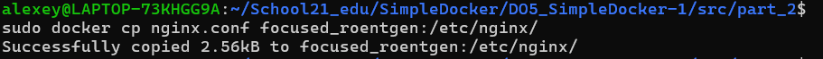
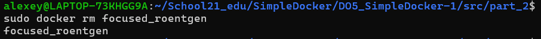
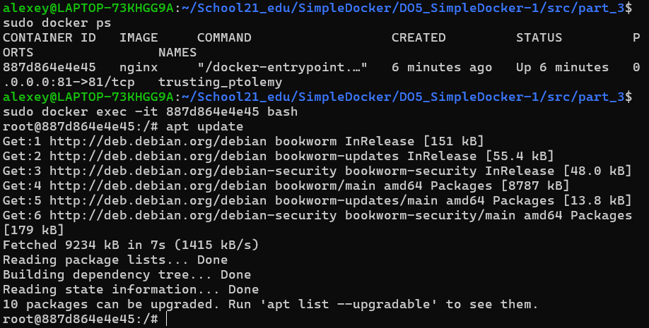

## Part 1. Готовый докер

### 1.1 Возьмём официальный докер-образ с **nginx** и выкачаем его при помощи `docker pull`.

- ##### Используем команду `docker pull nginx`
   

### 1.2 Проверим наличие докер-образа через `docker images`.

- ##### Используем команду `docker images`
  

### 1.3 Запустим докер-образ через `docker run -d [image_id|repository]`.

- ##### Используем команду `docker run -d 5ef79149e0ec`
  

### 1.4 Проверим, что образ запустился через `docker ps`.

- ##### Используем команду `docker ps`
  

### 1.5 Посмотрим информацию о контейнере через `docker inspect [container_id|container_name]`.

- ##### Используем команду `docker inspect jovial_lewin`
  

#### 1.6 По выводу команды определи и помести в отчёт размер контейнера, список замапленных портов и ip контейнера.

- ##### Определим размер контейнера командой `docker inspect jovial_lewin --size | grep -i -e size`

  

    `ConsoleSize`: Консольный размер (не определен).
    `ShmSize`: 64 МБ выделено для разделяемой памяти.
    `SizeRw`: 1095 байт данных записано в контейнер.
    `SizeRootFs`: Общий размер файловой системы контейнера составляет примерно 179 МБ.

- ##### В выводе команды `docker inspect jovial_lewin` найдём список замапленных портов

  

- ##### Найдём ip контейнера используя команду `docker inspect jovial_lewin | grep -i ipaddress`

  
   
   Контейнер с именем jovial_lewin имеет основной IP-адрес 172.17.0.2 в сети Docker

### 1.7 Остановим докер образ через `docker stop [container_id|container_name]`.

### 1.8 Проверим, что образ остановился через `docker ps`.

    

### 1.9 Запускаем докер с портами 80 и 443 в контейнере, замапленными на такие же порты на локальной машине, через команду *run*.

- ##### Используем команду `docker run -d -p 80:80 -p 443:443 nginx`
- ##### Для проверки используем команду `docker ps`

  

    *PORTS: 0.0.0.0:80->80/tcp, 0.0.0.0:443->443/tcp*

    Порты, через которые доступен контейнер:
    0.0.0.0:80->80/tcp: Порт 80 на вашем локальном хосте (0.0.0.0) перенаправляется на порт 80 внутри контейнера. Это означает, что если вы зайдете на http://localhost:80 на своем компьютере, вы попадете на веб-сервер Nginx, запущенный в контейнере.
    0.0.0.0:443->443/tcp: Порт 443 на локальном хосте перенаправляется на порт 443 внутри контейнера. Это позволяет доступ к контейнеру через HTTPS по адресу https://localhost:443.

  

### 1.11 Перезапустим докер контейнер через `docker restart [container_id|container_name]`.

### 1.12 Проверим любым способом, что контейнер запустился.

- ##### Смотрим название запущенного образа. Используем команду `docker ps`
- ##### Перезагружаем контейнер. Используем команду `docker restart  e3e4e38c715b`

  

## Part 2. Операции с контейнером

Докер-образ и контейнер готовы. Теперь можно покопаться в конфигурации **nginx** и отобразить статус страницы.

### 2.1 Прочитаем конфигурационный файл _nginx.conf_ внутри докер контейнера через команду _exec_.

- ##### Используем команду `docker exec vigilant_khorana cat /etc/nginx/nginx.conf`

    

    Основные секции конфигурационного файла Nginx:
    
    `user nginx;`

    Указывает пользователя, от имени которого запускаются рабочие процессы Nginx. В данном случае это пользователь nginx.
    
    `worker_processes auto;`

    Определяет количество рабочих процессов Nginx. Значение auto означает, что Nginx автоматически определяет количество процессов в зависимости от количества доступных процессорных ядер.
    
    `error_log /var/log/nginx/error.log notice;`

    Указывает путь к файлу для записи ошибок (/var/log/nginx/error.log). Уровень логирования установлен на notice, что означает, что будут записываться уведомления и сообщения более высокого уровня (например, предупреждения и ошибки).
    
    `pid /var/run/nginx.pid;`

    Указывает файл, в котором хранится PID (идентификатор процесса) основного процесса Nginx.

    Секция `events`:

    `worker_connections 1024;`
    Устанавливает максимальное количество соединений, которые может одновременно обрабатывать каждый рабочий процесс Nginx. В данном случае это 1024 соединения.

    Секция `http`:

    Эта секция содержит настройки для обработки HTTP-запросов.

    `include /etc/nginx/mime.types;`

    Подключает файл mime.types, который определяет типы контента на основе расширения файла (например, text/html, image/jpeg).

    `default_type application/octet-stream;`

    Устанавливает тип контента по умолчанию на application/octet-stream, если не удалось определить MIME-тип.
    
    `log_format main ...`

    Определяет формат журнала доступа. В данном случае, формат main содержит много информации о каждом запросе, включая IP-адрес клиента, дату и время, метод запроса, URL, статусный код ответа, размер переданных данных, реферер, юзер-агент и возможные прокси-заголовки.

    `access_log /var/log/nginx/access.log main;`

    Указывает файл для записи журнала доступа (/var/log/nginx/access.log) с использованием формата main.

    `sendfile on;`

    Включает использование sendfile(), что позволяет ускорить передачу данных, отправляя их напрямую из файлов в сокет.
    
    `keepalive_timeout 65;`

    Устанавливает тайм-аут для сохранения активных соединений (keep-alive) на 65 секунд.

    `include /etc/nginx/conf.d/*.conf;`

    Подключает все конфигурационные файлы, которые находятся в директории /etc/nginx/conf.d/. Это позволяет структурировать конфигурацию Nginx, разбивая её на несколько файлов.

### 2.2 Создадим на локальной машине файл _nginx.conf_.

### 2.3 Настроем в нем по пути _/status_ отдачу страницы статуса сервера **nginx**.

- ##### В файле nginx.conf прописываем
    
    

    Добавленный блок `server` определяет новый виртуальный сервер, который будет прослушивать HTTP-запросы на порту 80.
    Данный сервер будет обрабатывать запросы, поступающие на этот порт, и применяет соответствующие правила конфигурации, заданные в его блоке.

    Директива `listen 80;`:

    Указывает, что сервер должен прослушивать соединения на порту 80 (стандартный порт для HTTP).

    Директива `location /status { stub_status on; }`:

    Определяет новый URL-адрес /status, по которому будет доступна встроенная страница с краткой статистикой о состоянии Nginx (активные соединения, запросы и т.д.).

### 2.4 Скопируем созданный файл _nginx.conf_ внутрь докер-образа через команду `docker cp`.

Я перезапускал докер, поэтому имя машины поменялось, но на данном этапе это неважно. А еще я защел в своего домашнего пользователя, где у меня проект, чтобы спокойно совершить дальнейшее действие.

- ##### Используем команду `docker cp nginx.conf focused_roentgen:/etc/nginx/`
  

- ##### Используем команду `docker exec focused_roentgen nginx -s reload`
  

### 2.6 Проверим, что по адресу _localhost:80/status_ отдается страничка со статусом сервера **nginx**.

- ##### Используем команду `docker exec focused_roentgen curl localhost:80/status`
  
  

### 2.7 Экспортируем контейнер в файл _container.tar_ через команду _export_.

- ##### Используем команду `docker export -o container.tar focused_roentgen`
  

### 2.8 Остановим контейнер.

- ##### Используем команду `docker stop focused_roentgen`
- ##### Выполняем проверку `docker ps`

  

### 2.9 Удалим образ через `docker rmi [image_id|repository]`, не удаляя перед этим контейнеры.

- ##### Используем команду `docker rmi -f nginx`
  

### 2.10 Удалим остановленный контейнер.

- ##### Используем команду `docker rm focused_roentgen`
  

### 2.11 Импортируем контейнер обратно через команду _import_.

- ##### Используем команду `docker import -c 'cmd ["nginx", "-g", "daemon off;"]' -c 'ENTRYPOINT ["/docker-entrypoint.sh"]' container.tar nginx`
  

### 2.12 Запустим импортированный контейнер.

- ##### Используем команду `docker run -d -p 80:80 -p 443:443 nginx`
  

### 2.13 Проверим, что по адресу _localhost:80/status_ отдается страничка со статусом сервера **nginx**.

- ##### В любом браузере вводим команду `localhost:80/status`
  

## Part 3. Мини веб-сервер

### 3.1 Напишем мини-сервер на **C** и **FastCgi**, который будет возвращать простейшую страничку с надписью `Hello World!`.

- ##### Создаем файл miniserver.c в папке part_3.
  

    Библиотека FastCGI предоставляет расширенный интерфейс для создания FastCGI приложений. Она позволяет вашим программам работать как FastCGI-приложение, обрабатывая запросы от веб-сервера и возвращая ответы.

### 3.3 Напишем свой _nginx.conf_, который будет проксировать все запросы с 81 порта на _127.0.0.1:8080_.

  

    Проксирование (или проксирование запросов) — это процесс перенаправления сетевых запросов от одного сервера к другому. В контексте веб-серверов, таких как Nginx, это означает, что когда сервер получает запрос от клиента (например, браузера), он не обрабатывает его сам, а пересылает (проксирует) его на другой сервер или службу для обработки.

    Когда мы говорим, что "Nginx будет проксировать все запросы с 81 порта на 127.0.0.1:8080", это означает следующее:

    Клиент делает запрос:

    Допустим, клиент (например, браузер) отправляет запрос на наш сервер по адресу http://<ваш-сервер>:81.

    Nginx получает этот запрос:

    Nginx настроен слушать порт 81 и получать на него входящие запросы.
    Nginx перенаправляет (проксирует) запрос на другой сервер:

    Вместо того чтобы обрабатывать запрос сам, Nginx пересылает его на другой сервер, который находится на локальной машине по адресу 127.0.0.1 и слушает порт 8080.

    После этого Nginx получает ответ от этого сервера и возвращает его клиенту, как если бы обработал запрос сам.

### 3.4 Скачиваем и запускаем образ nginx

- ##### Используем команду `docker run -d -p 81:81 nginx`

### 3.5 Копируем .c файл в /home/, а .conf файл в /etc/nginx/

- ##### Используем команду `docker cp miniserver.c trusting_prolemy:/home/`
- ##### Используем команду `docker cp nginx.conf trusting_prolemy:/etc/nginx/`
  
 
### 3.6 Заходим в контейнер чтобы установить и обновить gcc, spawn-fcgi, libfcgi-dev

- ##### Чтобы зайти в контейнер используем команду `docker exec -it 887d864e4e45 bash`
- ##### Обновляем `apt update`

  

- ##### Устанавливаем необходимые репозитории `apt install gcc`
- ##### Устанавливаем необходимые репозитории `apt install spawn-fcgi`
- ##### Устанавливаем необходимые репозитории `apt install libfcgi-dev`

### 3.7 Компилируем и запускаем сервер

- ##### Переходим в директорию /home и выполняем команду `gcc -o miniserver miniserver.c -lfcgi`
  
  

- ##### Запускаем сервер `spawn-fcgi -p 8080 ./miniserver`
  
  

### 3.8 Проверим, что в браузере по _localhost:81_ отдается написанная страничка.

- ##### В браузере вводим `localhost:81`
  
